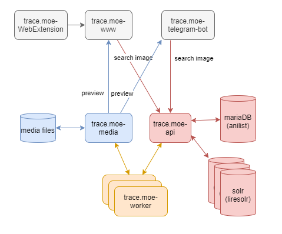

# trace.moe

[](https://github.com/soruly/trace.moe/blob/master/LICENSE)
[](https://discord.gg/K9jn6Kj)

Anime Scene Seach Engine

Trace back the scene where an anime screenshots is taken from.

It tells you which anime, which episode, and the exact moment this scene appears.

## Demo


Try this image yourself.


## Overview

This repo is just an index page for the whole trace.moe system. It consists of different parts as below:



Client-side (gray parts):

- [trace.moe-www](https://github.com/soruly/trace.moe-www) - web server serving the webpage [trace.moe](https://trace.moe)
- [trace.moe-WebExtension](https://github.com/soruly/trace.moe-WebExtension) - browser add-ons to help copying and pasting images
- [trace.moe-telegram-bot](https://github.com/soruly/trace.moe-telegram-bot) - official Telegram Bot

Server-side (blue and red parts):

- [trace.moe-api](https://github.com/soruly/trace.moe-api) - API server for image search and database updates
- [trace.moe-media](https://github.com/soruly/trace.moe-media) - media server for video storage and scene preview generation
- [LireSolr](https://github.com/soruly/liresolr) - image analysis and search plugin for Solr

Others (orange parts):

- [trace.moe-worker](https://github.com/soruly/trace.moe-worker) - video analysis and indexing
- [anilist-crawler](https://github.com/soruly/anilist-crawler) - getting anilist info and store in mariaDB
- [slides](https://github.com/soruly/slides) - pass presentation slides on project status
- [sola](https://github.com/soruly/sola) - an offline standalone version that combines liresolr and trace.moe-worker. (no longer in development)

## Integrations

The easiest way to integrate with trace.moe is by query string. No API needed.

You can pass image URL in query string like this

```
https://trace.moe/?url=http://searchimageurl
```

## trace.moe API

Refer to https://github.com/soruly/trace.moe-api
